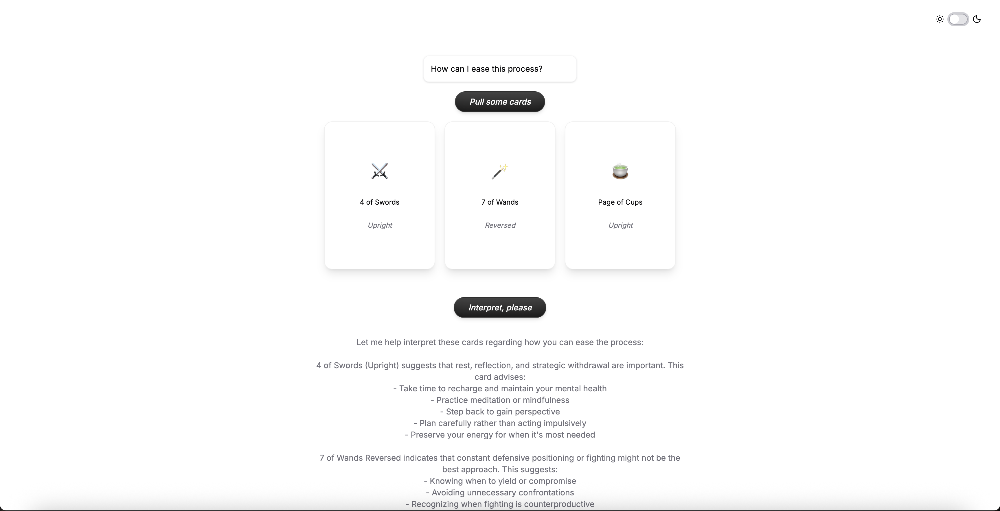

# 🔮 Arcana — Tarot Card Generator & Interpreter

Arcana is a simple tarot card reading web app built with Next.js and Flask. It lets users pull tarot cards, ask personalized questions, and receive interpretations using Anthropic's *Sonnet 3.5* model. The interface includes a clean design, dynamic card rendering with emoji suits, and full light/dark theme support.

---

## ✨ Features

* 💬 Ask a personal question to guide the reading
* 🎴 Draw 1–5 random tarot cards (Major + Minor Arcana)
* 🤖 Receive an AI-generated interpretation
* 💡 Light & dark mode with animated transitions
* 🌈 Glossy animated buttons and emoji-enhanced cards
* 📚 Session memory support for multi-step readings


---

## 🧱 Tech Stack

### Frontend

* **Next.js (App Router)**
* **React (Client Components)**
* **Tailwind CSS** for styling
* **Lucide Icons** + emojis for card symbols
* **Light/Dark Mode** with `next-themes`

### Backend

* **Flask** API for `/draw` and `/interpret` endpoints
* **Anthropic API** integration (Sonnet 3.5)
* **In-memory conversation history**

---

## 🚀 Getting Started

### 1. Clone the repo

```bash
git clone https://github.com/delaralomen/arcana.git
cd arcana
```

### 2. Install dependencies

```bash
npm install  # frontend
pip install -r backend/requirements.txt  # backend
```

### 3. Start the backend (Flask)

```bash
cd backend
export ANTHROPIC_API_KEY=*your_key_here*
python app.py
```

### 4. Start the frontend (Next.js)

```bash
npm run dev
```

Then open [http://localhost:3000](http://localhost:3000) in your browser.

By default, the frontend will fetch from `http://127.0.0.1:5050/api`.

---

## 🧪 API Endpoints

`GET /api/draw`

Returns a JSON response with a random tarot reading of 1 to 5 cards.

Payload:
```json
{
  "num_cards": 3,
  "reading": [
    { "card": "The Fool", "orientation": "Upright" },
    { "card": "Ace of Cups", "orientation": "Reversed" },
    { "card": "The Moon", "orientation": "Upright" }
  ]
}
```

`POST /api/interpret`

Takes a user prompt + set of drawn cards and returns an interpretation using Anthropic API.

Payload:

```json
{
  "prompt": "What should I focus on today?",
  "cards": [
    { "card": "The Empress", "orientation": "Upright" },
    { "card": "2 of Cups", "orientation": "Reversed" }
  ]
}
```


---

## 📁 Project Structure

```
arcana/
├── backend/              # Flask server
│   └── main.py
├── frontend/             # Next.js frontend
│   ├── app/              # App Router structure
│   ├── components/       # UI and utility components
```

---

## 🎨 Screenshots

### Light Mode


### Dark Mode


---

## 🤝 Credits

Inspired by mysticism. Crafted with code.
UI components powered by [shadcn/ui](https://ui.shadcn.com)


